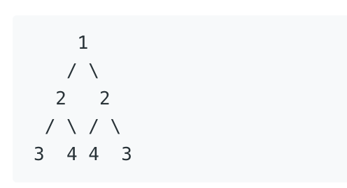
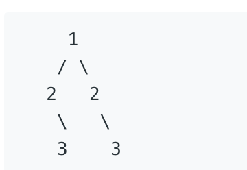
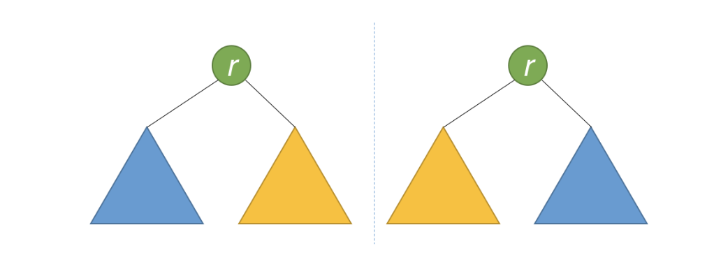

### [对称二叉树](https://leetcode-cn.com/problems/symmetric-tree/submissions/)

#### 题目描述:

> 给定一个二叉树，检查它是否是镜像对称的。
> 例如，二叉树 [1,2,2,3,4,4,3] 是对称的。
> 
> 但是下面这个 [1,2,2,null,3,null,3] 则不是镜像对称的:
> 

#### 思路

> 1、递归
> 2、如果一个树的左子树和右子树镜像对称，那么这个树是对称的.
> ![转换关系]](./img/tree_03.png)
> 3、因此，该问题就可转换为:两个树在什么条件下镜像对称?
> 如果同时满足以下条件，则这两个树互为镜像对称

- 他们的跟节点具有相同的值
- 每个树的右子树都与另一个树的左子树镜像对称
  

#### 代码

```javascript
/**
 * Definition for a binary tree node.
 * function TreeNode(val) {
 *     this.val = val;
 *     this.left = this.right = null;
 * }
 */
/**
 * @param {TreeNode} root
 * @return {boolean}
 */
var isSymmetric = function(root) {
  return isMinor(root, root)
}
var isMinor = function(t1, t2) {
  if (t1 === null && t2 === null) return true
  if (t1 === null || t2 === null) return false
  return (
    t1.val === t2.val &&
    isMinor(t1.left, t2.right) &&
    isMinor(t1.right, t2.left)
  )
}
```
